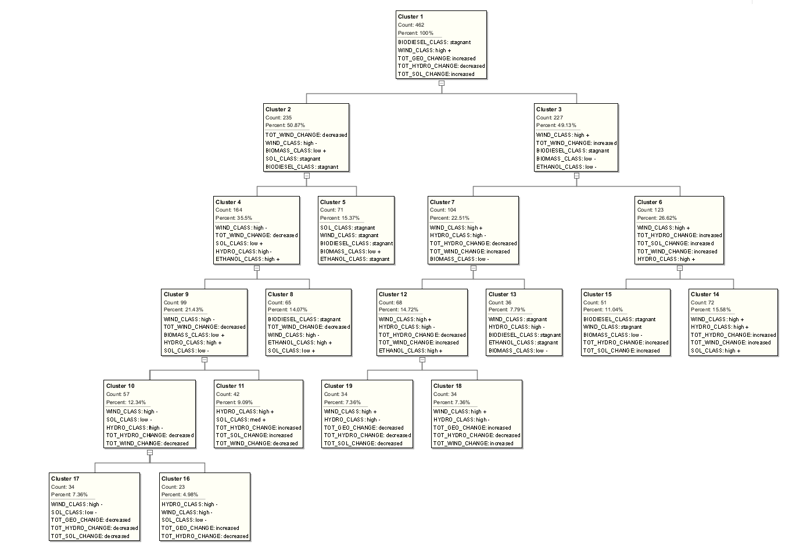
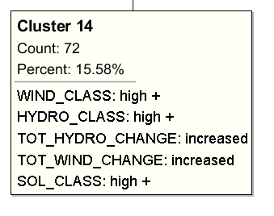
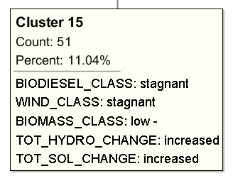
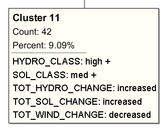
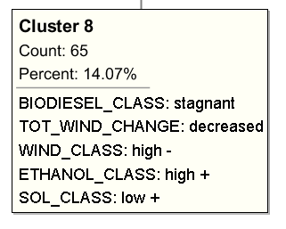

US Energy
====
##Dataset

Our data was taken from eia.gov. [Energy Information Administration](http://eia.gov).
EIA provides a wide range of information and data products covering energy production, stocks, demand, imports, exports, and prices.
In particular, we focused on energy production relating to renewable energy.
This includes Solar, Geothermal, Wind, Hydroelectric, Biomass, Biodiesel, and Ethanol.
EIA provides monthly energy reviews, and have been publishing them since 1976, with
both annual and monthly data statistics.
We downloaded multiple tables and uploaded them to the DS_US_ENERGY account.

##Summary
By using anomaly detection from Oracle Data Miner, we were able to identify multiple
months of abnormal growth in energy production. With the current data we have, we were
unable to identify why these months exhibited large growth in their respective energy
sources. Follow-up investigations on these particular years is required. 

This summary lists the years of the anomalous months for generality.
The values are in percent and represent the percent growth of the particular energy
source in contrast with the previous month.

##Analysis

###Oracle Data Miner
The major focus of our analysis was the Anomaly Detection algorithm of Oracle
Data Miner. In short, the Anomaly Detection algorithm examines the data given to it,
and records 2 values that describes the abnormality of each entry.
These 2 values produced by the SVM (Support Vector Machine) are the ANOM_SVM_PRED and
ANOM_SVM_PROB.

We also briefly investigated Clustering but were not able to fully grasp the results
of the algorithm.

####Workflow
Our workflow is included in the DataMiner folder.
Here is a picture showing our Anomaly Detection Query
Data Correction SQL Queries were required to convert Date/Time values into numeric
values as well as aggregate the data allowing for the creation of the calculated fields
needed by the Anomaly Detection.

####SQL Queries
We were able to aggregate energy output from a specific source after using subqueries.
We totaled each energy source by adding the output from each sector. 

For example: We summed the total solar energy output for that month by adding the
residential sector output, industrial output, commercial output, and so forth.

In order to generate useful calculated fields, we used the lag function to calculate
percent growth of energy output from the previous month. We then classified growth for
each source with a relative range.

	Each calculation has a raw percent as well as a classified field of [High - , Med - ,Low - , stagnant , Low + , Med + , High +]

We used these in our anamoly detection algorithms

###ANOMALY DETECTION

####ANOM_SVM_PRED
A value of 0 indicates that the entry is anomalous.
A value of 1 indicates that the entry is NOT anomalous.

####ANOM_SVM_PROB
This value indicates the probability that the entry is typical or atypical.
The higher the value (as it gets closer to 1) the more anomalous the entry is.

####Anomaly Detection Result Sample
A small sample picture of the Anomaly Detection Query.

Sorted first by ANOM_SVM_PRED-Ascending(anomalous entries at the top/Value of 0)

Then by ANOM_SVM_PROB-Descending(most anomalous entries at the top/Highest probability)

###Tableau
We then extracted this table to an excel file to allow it to be plotted in Tableau.

The table is located in Tableau folder and is named "Anomaly.xlsx"

####Tableau Representation of Anomalies
In this Tableau representation, each circle represents a MONTH. Notice that in a
particular year, there are overlapping circles to represent each month of that year.

The X Axis represents years.

ANOM_SVM_PRED is denoted by color, where RED indicates the month had a value of 0,
and is therefore an anomaly.

Green indicates the month is NOT anomalous.

ANOM_SVM_PROB is the Y Axis.

From this representation, we notice 5 anomalous MONTHS in the years 1976, 1981,
1989, 2010, and 2014.

We now decided to look at those particular anomalous months and examine their
respective energy production values.

###Anomaly Analysis
Because there is only 1 anomalous month in the years mentioned above, we will
just refer to the anomalies by their year.

We examined each month's energy production and here are our results.

####1976
The reason why 1976 was so high on the SVM's probability value is that it was the
very first entry recorded and displayed unique values for our calculated fields.

It was the only month that displayed stagnant and same values for each energy source.

####1981
From the picture below, you can see the extremely high percent growth of Ethanol
relative to the other energy sources.

####1981 Ethanol Tableau
A Tableau representation of Ethanol Percent Growth (with Anomalies colored) over the
years shows that 1981 is most likely anomalous due to Ethanol's abnormal growth in 
that one instance.

####1989
In 1989, examination of energy production of all energy sources shows that there
was a large growth in Solar and Wind energy. We now have to examine both Solar
and Wind Energy production over the years.

####1989 Solar Tableau
As you can see, a plot of Solar Production over the years shows the extremely large
growth in 1989.

####1989 Wind Tableau
As you can see, a plot of Wind Production over the years shows the extremely large
growth in 1989.

NOTE: An important point is that there was an even larger growth in 1994.

This will be addressed later, for now it is safe to say that 1989 was considered
anomalous due to the large Solar and Wind growth in production.

####2010
In 2010, examination of energy production of all energy sources shows that there
was a large growth in Biodiesel production.

####2010 Biodiesel Tableau
Again we look at the Tableau representation of Biodiesel Percent Growth (with Anomalies
colored). This shows that 2010 is most likely anomalous due to Biodiesel's abnormal 
growth in that particular month.

####2014
Finally, the last anomaly to examine is 2014. examination of energy production of all 
energy sources shows that there was a decent growth in Solar and Hydroelectric
production.

#####NOTE: However these values are nowhere near as large as our previous growths.

####2014 Hydroelectric Tableau
Just like before we look at the Tableau representation of Hydroelectric Percent Growth
(with Anomalies colored). This however shows that the growth of Hydroelectric Energy
wasn't necessarily that high in comparison with its other years.

We can conclude that hydroelectric energy growth was not a large factor in the SVM's
decision to deem this month anomalous.

####2014 Solar Tableau
Because the Solar Tableau representation is skewed with the extremely large growth in
1989, we filtered out that particular month and examined the rest of the entries.

Once filtered, we can see that 2014 does have a relatively large percent growth
in comparison with the other months. This could be why 2014 was considered anomalous
by the SVM.

####Wind Revisited
Going back to Wind Production over the years, we notice that 1994 was anomalous but
was not listed in our top 5 anomalous years.

#####Anomalies Picture
#####NOTE: NO 1994

####1994
Looking further we can see that Wind growth compared to other energy sources was
extremely large but also that this growth is the HIGHEST out of any of the other
anomalous months (Previous high was ~70% increase in solar 1989).

This wind percentage growth is 116%!

####1994 Summary
Although this wind growth was the highest we've seen out of any energy source,
the SVM did not give the entry a high probability value and was therefore not
in the top 5 anomalous months.

###CLUSTERING
We also briefly investigated clustering on our datasets. Here are our results.

####Clustering Results

####Clustering Analysis
The clusters we examined contained 10% or higher of the total count. 
In this case, there were 4 clusters with a > 10% count:

Cluster 14

Cluster 15

Cluster 11

Cluster 8

We tried to investigate these clusters individually.

We wrote a small program that matched each month in our data to the attributes in each
cluster. It goes through the text document containing the data, and parses line by line
and matches the attributes per column. If it matches every attribute, it prints out the
year and month.

The program is included in the Cluster folder(named cluster.java) along with the input
for the program (monthlycluster.txt)

####Cluster 14

#####Program Output:

Year: 1986  Month: 3

Year: 1989	Month: 1

Year: 1989	Month: 3

Year: 1991	Month: 5

Year: 1993	Month: 3

Year: 1994	Month: 3

Year: 1999	Month: 3

Year: 2001	Month: 3

Year: 2002	Month: 6

Year: 2002	Month: 7

Year: 2003	Month: 6

Year: 2005	Month: 6

Year: 2006	Month: 5

Year: 2007	Month: 3

Year: 2008	Month: 3

Year: 2009	Month: 3

Year: 2012	Month: 3

Year: 2014	Month: 6

#####Cluster 14 Observation
These months shared all of the attributes in the clusters. There are many months not
listed here because they do not exactly match every attribute for the cluster. For
example, for cluster 14, the clustering algorithm found 72 months that shared some of
the attributes found, they do not necessarily possess the exact attributes in this
cluster. Thus, when we ran the small program, it only found a small set that matched
the attributes in cluster 14. However, we think that matching months are strong
representations of the data in that cluster. By "strong representation", we mean that
the months that shared the traits, for example in cluster 14, will largely revolve
around the years and months found in our program, namely:

1989: January - March

Early 1990's: March - May

1999 - 2010: March - July

That is the general trend found in the months that shares the attributes of cluster 14.
It seems as if wind, hydro, and solar energy experienced moderate growth from 1989 to
present day in the first half of each year if we generalize this trend further.

####Cluster 15

#####Program Output:

Year: 1977	Month: 4

Year: 1977	Month: 9

Year: 1978	Month: 4

Year: 1978	Month: 9

Year: 1979	Month: 4

Year: 1980	Month: 4

Year: 1981	Month: 4

Year: 1981	Month: 11

Year: 1982	Month: 4

Year: 1987	Month: 9

Year: 1988	Month: 9

#####Cluster 15 Observation
Most of the months gathered here were April and September, we're uncertain as to why
these months shared these attributes

####Cluster 11

#####Program Output:

Year: 1991	Month: 3

Year: 1992	Month: 3

Year: 1992	Month: 5

Year: 1998	Month: 5

Year: 2000	Month: 3

Year: 2007	Month: 6

Year: 2009	Month: 6

Year: 2010	Month: 6

Year: 2012	Month: 7

Year: 2012	Month: 6

Year: 2013	Month: 5

Year: 2013	Month: 6

#####Cluster 11 Observation
Most of the months gathered were from March to June. Which is primarily the Spring
season in the U.S. This could partially explain the increased solar energy production
as daylength is steadily increasing from the end of the Winter season and going into
Summer season.

####Cluster 8

####Program Output:

Year: 1991	Month: 1

Year: 1992	Month: 1

Year: 1994	Month: 8

Year: 1996	Month: 3

Year: 1997	Month: 3

Year: 1998	Month: 4

Year: 1998	Month: 3

#####Cluster 8 Observation
No generalized trend could be gathered here.

###Summary
Unfortunately, we were unable to explain these large energy growths or why
1994 was not listed higher in the anomalous probability scale.

We tried looking into energy prices and matching these energy growths with any
changes but found no correlations.

We also looked at energy subsidies and found no correlation with these growths.

Further investigation needed to explain these growths as well as clustering results.

